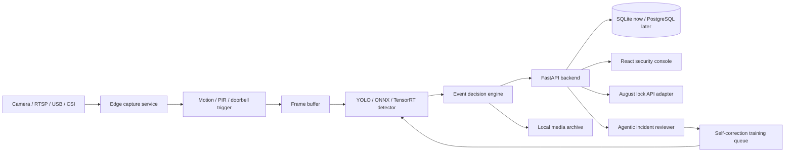

<p align="center">
  
</p>

# Sentinel Doorbell AI

Sentinel Doorbell AI is a local-first smart doorbell platform built as a breadth-heavy engineering showcase: edge computer vision, FastAPI services, a PostgreSQL-ready event model, React operations dashboard, agentic incident review, August lock integration stubs, cloud/devops artifacts, and ML pipelines that can be made real incrementally.

The goal is to look and read like a serious fullstack/ML/agentic/cloud project now, while keeping every external dependency replaceable later.

## What It Shows

- Edge AI pipeline for RTSP/USB/CSI camera capture, motion triggers, YOLO-style detections, robbery/package/visitor classification, and media storage.
- FastAPI backend with devices, events, predictions, lock operations, agentic reviews, health checks, and WebSocket broadcast scaffolding.
- SQLAlchemy models for devices, detections, events, occupancy predictions, automations, and agent runs.
- React + Vite dashboard with live camera mock, event triage, home-presence forecast, incident-risk scoring, lock controls, and agent self-correction status.
- ML services for home occupancy prediction, robbery/theft risk scoring, detector feedback loops, and future ONNX/TensorRT model loading.
- Agentic workflows for incident summarization, self-auditing false positives, retraining job proposals, and policy recommendations.
- Internal company platform layer: tenants, users, RBAC, scoped API keys, audit logs, incident cases, feature flags, notification escalation, model registry, labeling tasks, data retention, SLOs, dead-letter queues, fleet commands, usage metering, compliance exports, support tooling, release gates, and worker jobs.
- DevOps breadth: Docker Compose, Kubernetes manifests, Terraform sketch, systemd units, GitHub Actions, seed data, and observability config.

## Quick Start

```bash
cp .env.example .env
python3 -m venv .venv
source .venv/bin/activate
pip install -r requirements.txt
uvicorn backend.app.main:app --reload --port 8000
```

In a second terminal:

```bash
cd dashboard
npm install
npm run dev
```

Open `http://localhost:5173`. The UI uses the API when it is available and falls back to embedded demo data when it is not.

## Architecture



## Feature Surface

| Area | Implemented Now | Later Swap-In |
| --- | --- | --- |
| Backend | FastAPI routes, DB models, seeded data, service contracts | Auth, hosted API, real media serving |
| Frontend | Responsive security console with live status and controls | Real WebRTC/HLS stream, auth, mobile PWA |
| ML | Deterministic scoring services and model interfaces | YOLOv8/YOLO-NAS ONNX, TensorRT, real training |
| Agentic | Incident analyst, self-audit loop, retraining proposals | LLM tool calls, vector memory, auto-labeling |
| Smart Home | August lock adapter and automation policies | OAuth, live lock state, Home Assistant |
| Internal Platform | RBAC, audit, incidents, feature flags, MLOps governance, retention, metering, compliance, runbooks | Admin UI, real auth, queue workers |
| DevOps | Compose, K8s, Terraform, CI, systemd | Cloud deployment and secrets manager |

## Project Layout

```text
backend/      FastAPI application, DB models, APIs, services, agents
edge/         Camera, detection, event decision, hardware integration stubs
dashboard/    React/Vite dashboard
data/         SQL migrations and seed data
deploy/       Docker, Kubernetes, Terraform, systemd, observability
docs/         Architecture, APIs, role-tailoring, deployment notes
scripts/      Local demo, benchmark, retraining, model export helpers
models/       Model cards and placeholder model location
media/        Runtime event snapshots/clips
```

## Resume Angles

This repository is intentionally role-tailorable:

- Backend: FastAPI, SQLAlchemy, service boundaries, WebSockets, device APIs.
- ML: edge inference, risk scoring, occupancy prediction, feedback loop, model registry notes.
- Fullstack: polished React operations UI connected to a backend contract.
- DevOps: Docker/Kubernetes/Terraform/systemd/CI/observability.
- Agentic AI: self-correcting incident review loop and retraining proposal workflow.
- IoT/Embedded: camera abstraction, PIR/GPIO/lock integration stubs, edge deployment.

## Truth In Advertising

Several integrations are intentionally scaffolded: August OAuth, real camera streams, real YOLO weights, cloud hosting, and notification providers. The code is designed so those can be connected without changing the public architecture.
