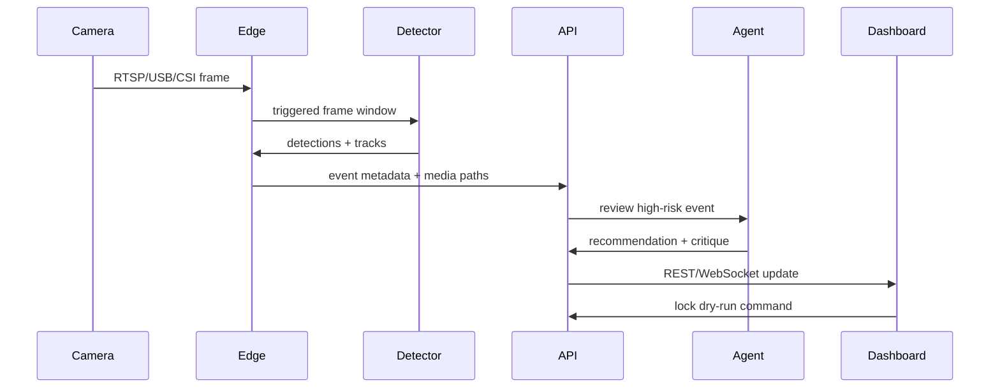

# Architecture

Sentinel Doorbell AI is structured as an event-driven edge platform.

## Service Boundaries

- `edge/capture`: frame acquisition, reconnects, normalized frame envelopes.
- `edge/inference`: model loading, detections, future ONNX/TensorRT execution.
- `edge/events`: cooldowns, duplicate suppression, ROI filtering, event classification.
- `backend/app/api`: public contracts for dashboard, devices, predictions, locks, and events.
- `backend/app/ml`: risk and occupancy model contracts.
- `backend/app/agents`: self-review and retraining proposal logic.
- `dashboard`: operator console and demo-first product surface.

## Data Flow

1. Camera source emits frames.
2. Motion or button trigger opens a pre/post event buffer.
3. Detector returns person/package detections.
4. Decision engine applies confidence, ROI, package-state, and cooldown gates.
5. Backend stores structured metadata and media paths.
6. Agent reviews risky events and proposes self-correction work.
7. Dashboard displays event status, model scores, lock state, and occupancy forecast.

